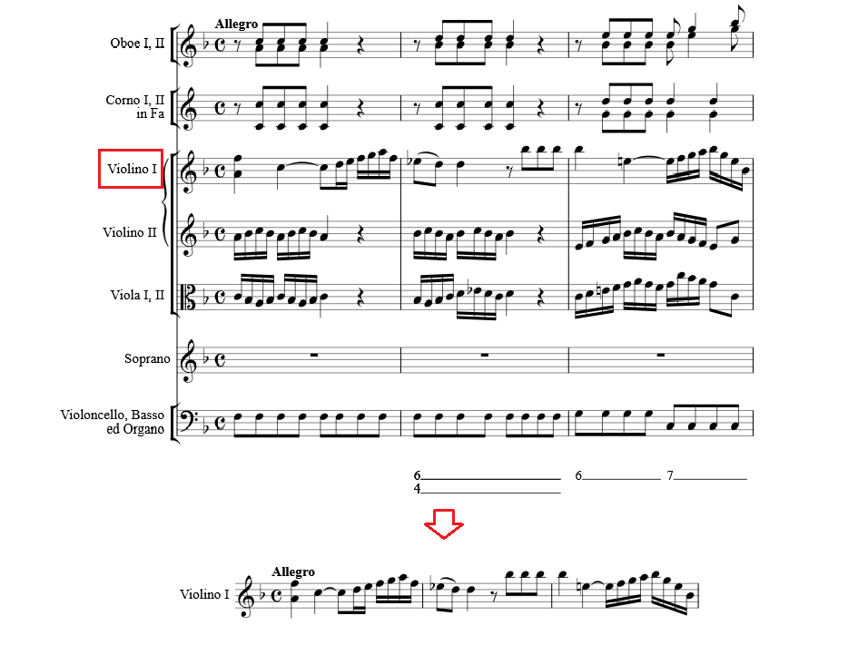
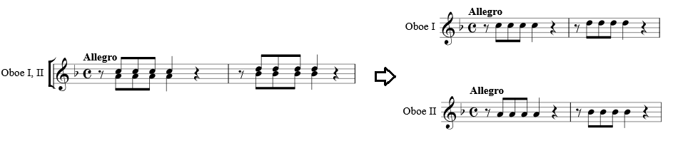
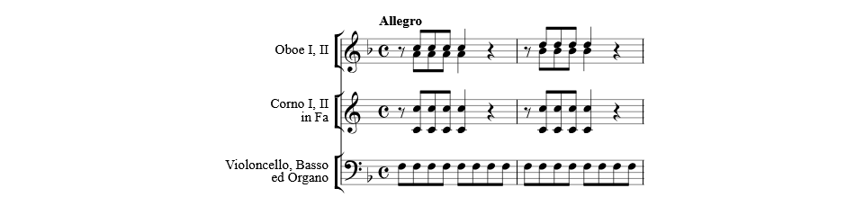
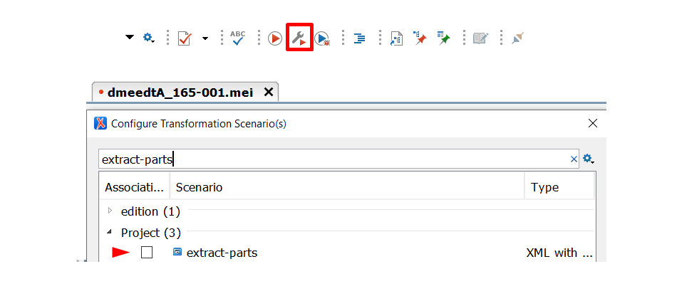
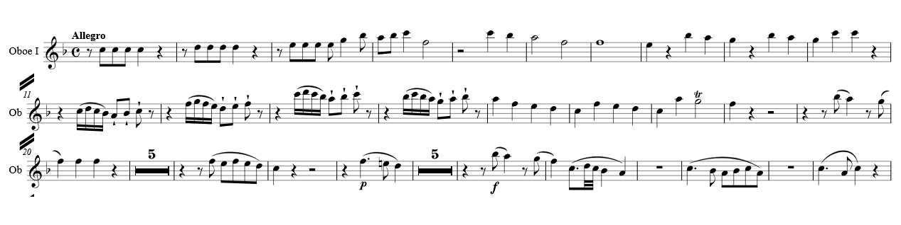
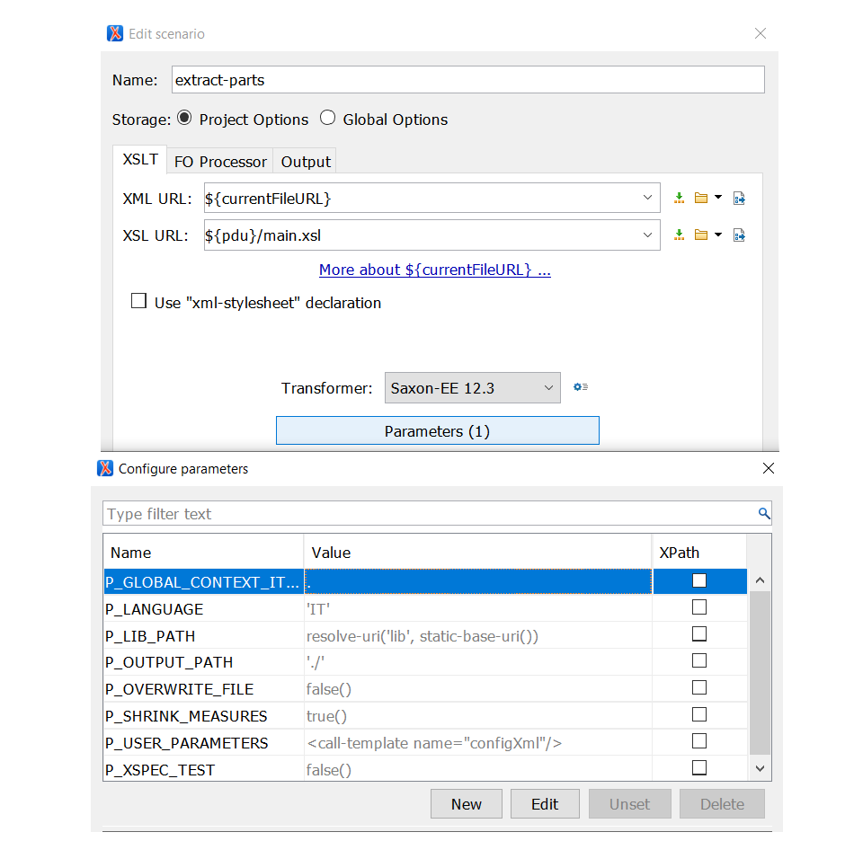
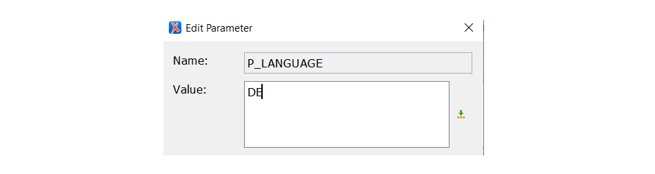

# Extract Parts: A Parts Extraction Tool for Musical Scores Encoded in the Music Encoding Initiative (MEI) Format

- [Features Overview](#features-overview)
- [Installation and Usage](#installation-and-usage)
- [Test Data](#test-data)
- [Limitations](#limitations)


## Features Overview

The parts extraction tool facilitates the creation of parts from a full orchestral score encoded in MEI format, provided that the data structure adheres to the specific encoding guidelines. For instance, you can extract the first violin part from a symphonic score.




The major benefit of the tool is the ability to extract parts that share a staff. Consider the following example, where the first and second oboes are notated on the same staff. Using _Extract Parts_, you can create separate parts for the first and second oboes.




In addition to the standard single-voice parts, it is possible to create custom score reductions. For example, the user may wish to extract the accompanying parts only.




## Installation and Usage

The tool is written in XSLT. If you are using the oXygen XML Editor, the repository provides a project file called `extract-parts.xpr` that contains the corresponding transformation scenario and the required settings. This can be opened by double-clicking in the file explorer or by opening it from the project view in the oXygen XML editor.

To illustrate, I will describe the process of extracting a first oboe part from a previously shown score. First, open the configuration file (`./config/config.xml`). Here you can select the parts you need by adding the element `<dme:part/>` as child of `<dme:parts/>`. Using the attributes `@dme:layer` and `@dme:staff` you can specify the staves and layers yuo want to extract.
```xml
<parameters xmlns="http://www.mozarteum.at/ns/dme">
  <parts>
    <part staff="1" layer="1"/>
  </parts>  
</parameters>
```

Then, apply the transformation scenario `extract-parts` to the file `./tests/data/K165/01/dmeedtA_165-001.mei`.




After applying the transformation scenario, a new MEI file `dmeedtA_165-001_(1-1).mei` is created in the same folder. The suffix `(1-1)` in the file name indicates the part that have been extracted.



Some of the default behaviour of the tool can be controlled by setting parameters. In the oXygen XML editor, this can be done by double-clicking on the transformation scenario and selecting the parameters dialogue box. You may also wish to make a copy of the original transformation scenario.




`P_LANGUAGE`  
The language of the instrument names and abbreviations generated by the tool is Italian by default. Other languages such as English and German are available. The language can be changed by setting the parameter to 'EN' or 'DE'.




For this feature, _Extract Parts_ uses an XML configuration file located in `./lib/lists/instruments`.xml. The file contains a comprehensive list of names and abbreviations and their transpositions for common instruments and voices.


`P_OUTPUT_PATH` and `P_OVERWRITE_FILE` 

The default output path of the file is in the same folder as the MEI file (`./`). You can change this by setting the parameter using the relative path syntax. For instance, if you want to output the MEI file to a different folder you can set the parameter as follows: `./output/`. Additionally, if you set `P_OVERWRITE_FILE` to `true()` you can use the save as option available in oXygen. and specify a different path or filename.


`P_SHRINK_MEASURES`  
  If the extracted part contains more then four measures with a rest, a multirest measure is created. If you have very good reasons, you can regulate this behaviour by setting the parameter to `true()` (default) or false(). Note that the `Evaluate as XPath` checkbox have to be enabled. This option is available for a single-part extraction only.


`P_GLOBAL_CONTEXT_ITEM and P_XSPEC_TEST`
Both parameters are used in the context of XSpec unit testing only.


P_LIB_PATH`
Relative of absulute path to the `lib` folder: `/path/to/the/lib`. Default: `lib`.

`P_USER_PARAMETERS`  
  This parameter defines which staves and layers are requested for extraction. This is an XML element defined in `/config/config.xml`. If all the parts in the score are requested, the file will be copied without processing.

## Test Data
_Extract Parts_ expects a specific data structure. Examples can be found in the `./tests/data` folder. However, not all data may be up to date. The following data is currently approved to be compliant with this version of the tool.
- `./tests/data/K165/01/dmeedtA_165-001.mei`
- `./tests/data/K165/01/dmeedtA_165-001_m11.mei`
- `./tests/data/K550/03/550-003_m9_(2).mei`
- `./tests/data/K621/621-23_m187_flutes.mei`
- `./tests/data/K621/621-23_m25_fagotti.mei`
- `./tests/data/290-001_m5_(3).mei`
- `./tests/data/K543/01/543-01_mm109-111_viola.mei`
- `./tests/data/K527/527-07_mm8-9_fagotto12.mei`
- `./tests/data/K550/01/550-001_m139-140_clarinetti.mei`
- `./tests/data/K621/621-23_m181_flutes.mei`


## Limitations 
- If the MEI file contains multiple `<scoreDef>`s with a different number of staves, the tool might not work properly. The workaround is to temporarily comment out the score portions.
- The handling of variants encoded using `<mei:choice/>` and `<mei:app/>` elements is a challenging area of development, as many combinations, including nesting, are possible. The current version of the tool partially supports variants, but it can make mistakes.
- To use the extracted parts for performance, you may need to make some modifications, such as adjusting line and page beginnings, adding cue notes, etc. 

**Current version**: _5.1.1_. For details see the CHANGELOG.

**Author**: oleksii.sapov-erlinger@mozarteum.at